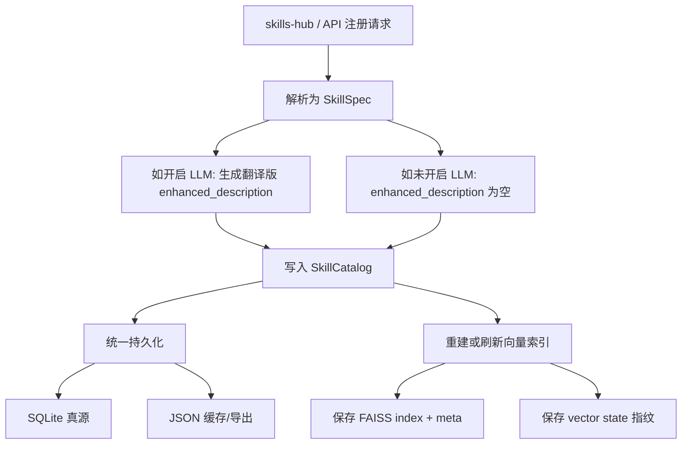
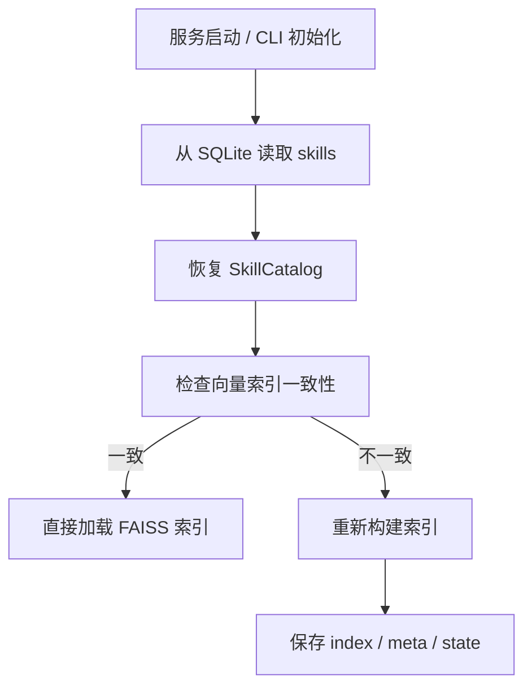
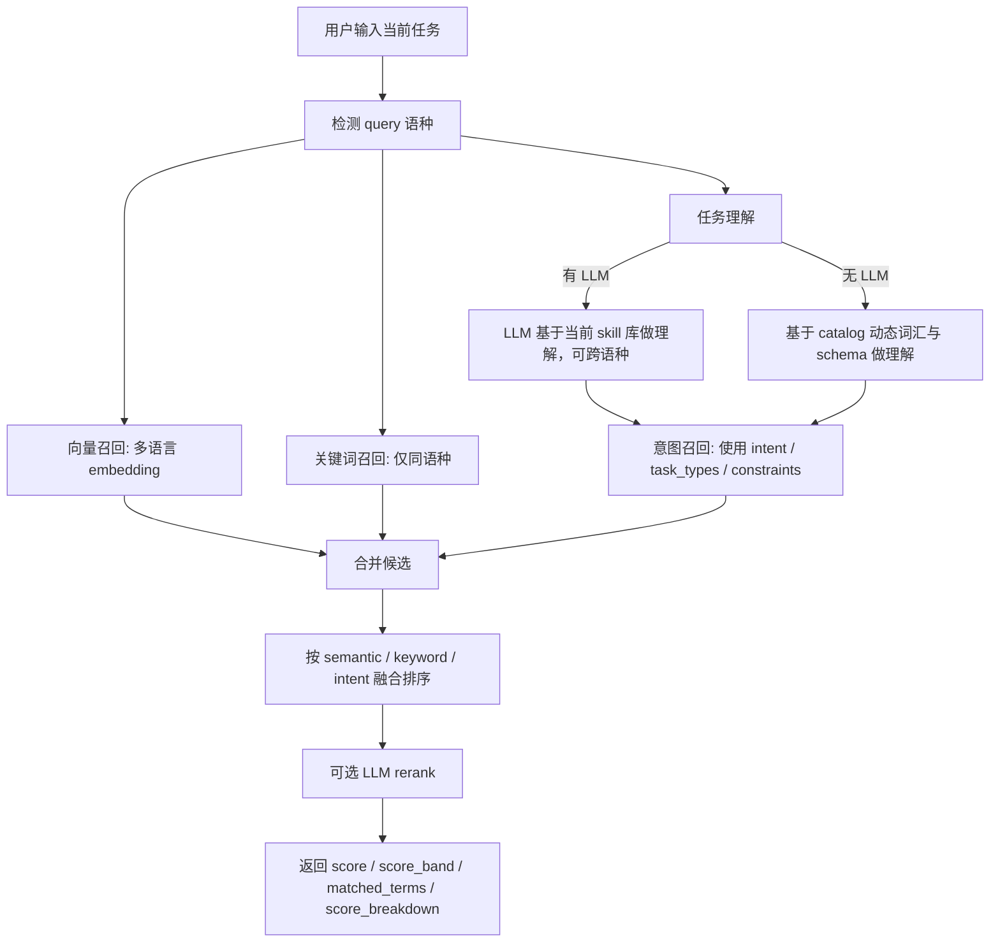

# Skill Recommend Server

`skill_recommend_server` 是一个完整的 Python 工程，用来解析 `skills-hub/` 中的技能文档，持久化保存 skills，构建向量索引，并通过 API、CLI 和 SDK 提供技能推荐能力。

## 项目结构

```text
skill_recommend_server/
|-- skills_recommender/
|   |-- api/
|   |-- catalog/
|   |-- config/
|   |-- embedding/
|   |-- llm/
|   |-- monitoring/
|   |-- recommendation/
|   |-- storage/
|   |-- vector_store/
|   |-- __init__.py
|   |-- __main__.py
|   |-- app_main.py
|   `-- sdk.py
|-- tests/
|-- examples/
|-- data/
|-- models/
|-- skills-hub/
|-- config.yaml
|-- pyproject.toml
|-- requirements.txt
|-- run.bat
`-- run.sh
```

## 设计约定

- 项目根目录就是启动目录。
- 正式入口统一为 `skills_recommender`。
- 支持直接在项目根目录运行 `python -m skills_recommender`。
- 不依赖 `src/` 或额外设置 `PYTHONPATH`。

## 安装

```bash
cd skill_recommend_server
pip install -r requirements.txt
```

开发模式安装：

```bash
pip install -e .
```

## 启动方式

启动 API：

```bash
python -m skills_recommender --api
```

热重载：

```bash
python -m skills_recommender --api --reload
```

启动时全量刷新 `skills-hub`：

```bash
python -m skills_recommender --api --update-skills
```

启动时全量刷新并启用 LLM 翻译增强：

```bash
python -m skills_recommender --api --update-skills --use-llm
```

Windows：

```bat
run.bat --api
```

Bash / Git Bash / WSL：

```bash
./run.sh --api
```

启动后可访问：

- `http://localhost:8000`
- `http://localhost:8000/docs`

## CLI 用法

命令行推荐：

```bash
python -m skills_recommender "分析产品的竞争力和改进方向"
```

JSON 输出：

```bash
python -m skills_recommender "分析产品的竞争力和改进方向" --json
```

重建向量索引：

```bash
python -m skills_recommender --init
```

## Python SDK

```python
from skills_recommender import create_recommender

recommender = create_recommender()
result = recommender.recommend("帮我生成一个 API 接口")
print(result)
```

## API 示例

推荐技能：

```bash
curl -X POST http://localhost:8000/recommend \
  -H "Content-Type: application/json" \
  -d "{\"query\": \"分析产品的竞争力和改进方向\"}"
```

获取技能列表：

```bash
curl http://localhost:8000/skills
```

增量导入 `skills-hub`：

```bash
curl -X POST http://localhost:8000/skills/import
```

全量更新并重建索引：

```bash
curl -X POST http://localhost:8000/skills/update-all
```

## 配置

主要配置位于 [config.yaml](/D:/code/github/hehe/find-skills/skill_recommend_server/config.yaml)。

```yaml
recommendation:
  final_top_k: 5
  task_understanding:
    enabled: true
    use_llm_when_available: false
    llm_temperature: 0.1
    max_keywords: 8
  recall:
    vector:
      enabled: true
      top_k: 50
      score_threshold: 0.5
    keyword:
      enabled: true
      top_k: 20
      score_threshold: 0.15
    intent:
      enabled: true
      top_k: 20
      score_threshold: 0.2
  scoring:
    semantic_weight: 0.7
    keyword_weight: 0.2
    intent_weight: 0.1
    usage_weight: 0.0
  rerank:
    enable_llm_rerank: true
    llm_top_n: 10
```

## 当前核心逻辑

### 注册与保存策略

- `skills-hub` 导入和 API 新增 skill 都会先进入 `SkillCatalog`。
- SQLite 是 skills 的真源。
- JSON 是可读缓存和导出副本。
- FAISS 是向量检索索引，属于衍生物，不是主存储。
- 启动时会校验 skills 指纹、embedding 模型路径和向量维度，不一致就自动重建索引。

### `enhanced_description` 生成规则

- 未开启 LLM 时，`enhanced_description` 为空。
- 开启 LLM 时，不再让 LLM 改写 `category` 和 `capabilities`。
- 开启 LLM 时，只会把 `"名称: 描述"` 翻译成另一种语言后写入 `enhanced_description`。
- 如果原始 skill 是中文，`enhanced_description` 写英文翻译。
- 如果原始 skill 是英文，`enhanced_description` 写中文翻译。

### 推荐策略

当前推荐采用：

`多路召回 -> 融合排序 -> 可选 LLM rerank`

#### 1. 任务理解

- 有 LLM 且配置允许时：
  - 由 LLM 基于当前 skill 库做结构化理解。
  - 可以处理中英文跨语种场景。
- 没有 LLM 时：
  - 由引擎基于当前 catalog 动态提取词汇和 schema 做启发式理解。
  - 不依赖写死任务词表。
  - 跨语种能力较弱，因此不会强行做跨语种意图匹配。
- 这一步不是推荐主流程的前置必选环节。
- 当前实现里，任务理解主要服务于意图召回和调试输出，不是向量召回与关键词召回的硬依赖。

#### 2. 多路召回

- 向量召回：
  - 主召回路径。
  - 使用多语言 embedding 做语义检索。
- 关键词召回：
  - 只使用 skill 的 `name` 与 `description/enhanced_description`。
  - 不再使用 `category`、`capabilities` 参与关键词得分。
- 意图召回：
  - 使用 `intent / task_types / constraints` 与 skill 任务词、约束词、描述词做匹配。
  - 这一条才依赖任务理解的结构化结果。

#### 3. 多语种规则

- 推荐时会先检测用户输入语种。
- 关键词得分只使用与 query 同语种的 `description` 或 `enhanced_description`。
- 若某个 skill 没有同语种描述文本，则该 skill 的 `keyword_score = 0`。
- 无 LLM 时，如果某个 skill 没有同语种描述文本，则该 skill 的 `intent_score = 0`。
- 有 LLM 时，允许跨语种意图理解，因此 `intent_score` 仍可参与。
- 展示推荐结果时，优先返回与 query 同语种的描述文本。

#### 4. 融合排序

当前默认权重为：

- `semantic_weight = 0.7`
- `keyword_weight = 0.2`
- `intent_weight = 0.1`
- `usage_weight = 0.0`

也就是说，当前是明显的“向量主路”策略。

### 当前更偏生产可用的优化

- skill 词汇、描述词和约束词做了内存缓存，并根据 catalog 指纹自动失效。
- `constraints` 优先从 `input_schema`、`output_schema` 和 skill 能力词推断。
- SQLite / JSON / FAISS 的一致性在更新后会统一刷新与校验。
- 推荐结果会输出 `score`、`score_band`、`matched_terms` 和 `score_breakdown`，便于调试。

## 流程图

### 注册与保存流程



### 启动与加载流程



### 推荐流程



## 测试

在项目根目录运行：

```bash
python -m unittest discover -s tests -p "test_*.py" -v
```

推荐专项测试：

```bash
python -m unittest tests.test_recommendation -v
```

存储专项测试：

```bash
python -m unittest tests.test_storage -v
```
